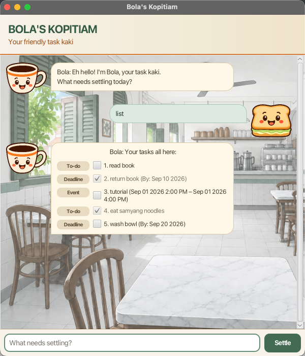

# Bola

> Your friendly task kaki.

Bola is a task-management chatbot built with Java 25 and JavaFX. It combines a conversational
interface with practical task tracking, wrapped in a Singapore kopitiam-inspired personality.



## Highlights

- Create to-dos, deadlines, and events with validated dates and times.
- Find tasks by keyword or view dated tasks coming up soon.
- Mark, unmark, or delete one task, several tasks, ranges, or the entire list.
- Use either the JavaFX desktop interface or the original console interface.
- Keep tasks between sessions through automatic local storage.
- Ask the optional AI helper natural-language questions about Bola's commands.

## Quick start

### Requirements

- Java 25
- The latest `bola.jar` from the project's GitHub releases

Put the JAR in the folder where you want Bola to keep its data, then run:

```shell
java -jar bola.jar
```

The graphical interface opens by default. For the console version, run:

```shell
java -jar bola.jar --cli
```

Bola stores tasks in `data/bola.txt`, relative to the folder from which it is launched.

See the [Bola User Guide](docs/README.md) for complete command formats, examples, date syntax,
mass operations, and troubleshooting.

## Commands at a glance

| Command | Purpose |
| --- | --- |
| `todo DESCRIPTION` | Add an undated task |
| `deadline DESCRIPTION /by DATE` | Add a task with a deadline |
| `event DESCRIPTION /from START /to END` | Add an event |
| `list` | Show all tasks |
| `find KEYWORD` | Find tasks by description |
| `upcoming DAYS` | Show dated tasks coming up soon |
| `mark SELECTION` | Mark tasks as complete |
| `unmark SELECTION` | Mark tasks as incomplete |
| `delete SELECTION` | Delete tasks |
| `@ai QUESTION` | Ask the optional AI helper about Bola |
| `help` | Show the built-in command reference |
| `bye` | Exit Bola |

## Optional AI help

The `@ai` command provides natural-language help about Bola's features without executing commands
or changing tasks:

```text
@ai how do I add a new deadline task?
@ai is there a command to add priorities to tasks?
```

AI help uses Groq's hosted `openai/gpt-oss-120b` model. It requires a Groq API key; it does not
use a ChatGPT account or an OpenAI API key. Create a key on the
[Groq API Keys page](https://console.groq.com/keys), then set it before starting Bola.

macOS or Linux:

```shell
export LLM_API_KEY="your_api_key_here"
java -jar bola.jar
```

Windows PowerShell:

```powershell
$env:LLM_API_KEY="your_api_key_here"
java -jar bola.jar
```

Never hard-code or commit an API key. Questions sent through `@ai` are processed by Groq, so do
not include private or sensitive information. Bola remains fully usable without a key and when
the remote service is unavailable.

## Development

Open the project in a recent version of IntelliJ IDEA and configure the project SDK and language
level for Java 25. Run `src/main/java/bola/Launcher.java` to start the GUI, or use Gradle:

```shell
./gradlew run
```

On macOS, the project uses the JavaFX-enabled Zulu JDK available through SDKMAN:

```shell
sdk use java 25.0.3.fx-zulu
```

To run the console interface during development:

```shell
./gradlew run --args='--cli'
```

The interface uses FXML views with Java controllers and CSS styling. Its structure follows the
[SE-EDU JavaFX tutorial](https://se-education.org/guides/tutorials/javaFxPart1.html), adapted for
Bola's resizable chat layout, task controls, response states, and kopitiam theme.

Keep Java source files under `src/main/java`; Gradle and the project tooling rely on this standard
directory structure.

## Testing

Run the complete automated checks with Java 25:

```shell
./gradlew check jacocoTestReport
```

This runs the JUnit suite, Checkstyle, and the 90% line-coverage gate. Console and GUI regression
plans are kept under `test/`.

## Building the JAR

Create the executable fat JAR with:

```shell
./gradlew shadowJar
```

On Windows, use `gradlew.bat shadowJar`. The output is `build/libs/bola.jar`. Build artifacts
should not be committed; publish the JAR through a GitHub release instead.

## Acknowledgements

- Bola began with the [SE-EDU iP starter repository](https://github.com/NUS-CS2103-AY2627-S1/ip)
  and draws on the SE-EDU JavaFX and
  [AI integration](https://se-education.org/guides/tutorials/addingAiToJavaApp.html) guides.
- [LangChain4j](https://docs.langchain4j.dev/) provides the Java integration used by the optional
  AI helper.
- I used OpenAI Codex throughout Bola's development as an AI coding collaborator. It
  helped with brainstorming, implementation, debugging, test design, code review, UI refinement,
  and documentation. I remained responsible for the project's direction, feature choices, final
  design decisions, and for reviewing and testing the changes included here.
- The kopitiam background and Bola/user avatars were created with OpenAI's image-generation tools.
  The prompts and intermediate artwork are retained under `output/` for transparency.
