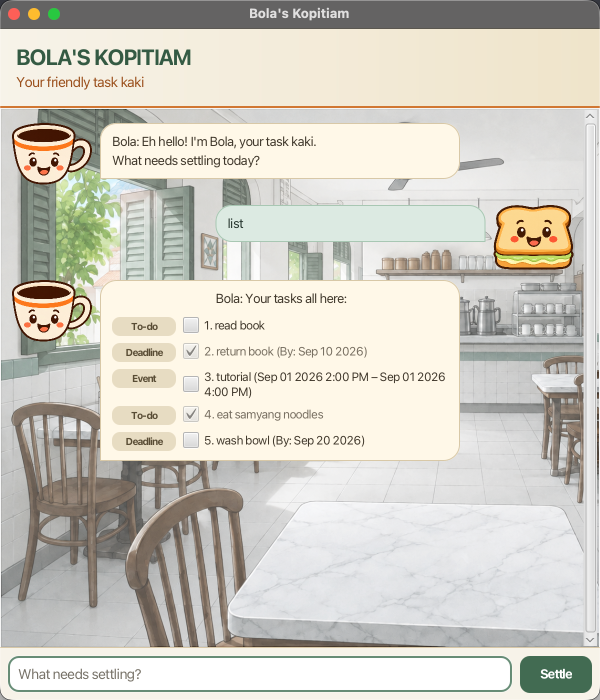

# Bola User Guide



**Bola** is a friendly task-management chatbot with a Singapore kopitiam personality. Use its
graphical interface to add, view, find, update, and save to-dos, deadlines, and events.

## Contents

- [Quick start](#quick-start)
- [Command format](#command-format)
- [Adding tasks](#adding-tasks)
- [Viewing and finding tasks](#viewing-and-finding-tasks)
- [Updating tasks](#updating-tasks)
- [Getting help](#getting-help)
- [Saving and recovering data](#saving-and-recovering-data)
- [Exiting Bola](#exiting-bola)
- [Command summary](#command-summary)

## Quick start

1. Install Java 25.
2. Download `bola.jar` from the latest GitHub release.
3. Put the JAR in the folder where you want Bola to store its data.
4. Open a terminal in that folder and run:

   ```shell
   java -jar bola.jar
   ```

5. Type a command into the box at the bottom of the window.
6. Press <kbd>Enter</kbd> or click **Settle**.

To use the console interface instead, run:

```shell
java -jar bola.jar --cli
```

## Command format

Examples in this guide use the following notation:

- Words in `UPPER_CASE` are parameters that you replace, such as a task description.
- Words beginning with `/`, such as `/by`, are literal separators that must be included.
- The command words and separators are case-sensitive and must be typed in lowercase.
- Confirmation answers, `Yes` and `No`, are not case-sensitive.

> [!TIP]
> Enter `help` whenever Bola is not waiting for confirmation to see a quick command reference.

## Adding tasks

Bola rejects impossible dates and duplicate tasks with an explanation. A valid task is saved
automatically.

### Adding a to-do: `todo`

Adds a task without a date.

**Format:** `todo DESCRIPTION`

```text
todo buy coffee beans
```

### Adding a deadline: `deadline`

Adds a task that must be completed by a date or time.

**Format:** `deadline DESCRIPTION /by DATE`

```text
deadline submit project report /by 2026-09-20
deadline send presentation slides /by 20/9/2026 1800
```

### Adding an event: `event`

Adds an activity with a start and end. The end must be later than the start.

**Format:** `event DESCRIPTION /from START /to END`

```text
event project demonstration /from 20/9/2026 1400 /to 20/9/2026 1500
```

### Date and time formats

Use one of these formats:

| Input | Format | Example |
| --- | --- | --- |
| Date only | `yyyy-MM-dd` | `2026-09-20` |
| Date and time | `yyyy-MM-dd HHmm` | `2026-09-20 1800` |
| Date and time | `d/M/yyyy HHmm` | `20/9/2026 1800` |

Times use the 24-hour clock. For example, `0900` is 9:00 AM and `1800` is 6:00 PM.

## Viewing and finding tasks

### Listing all tasks: `list`

Shows every task and its task number.

```text
list
```

Completed tasks contain `[X]`; incomplete tasks contain `[ ]`. In the graphical interface, you
can also select a task's checkbox to mark or unmark it immediately.

### Finding tasks: `find`

Finds tasks whose descriptions contain a keyword. Matching is not case-sensitive.

**Format:** `find KEYWORD`

```text
find report
```

The search-result numbers only number the results. To mark, unmark, or delete a task, use its
number from `list`.

### Viewing upcoming tasks: `upcoming`

Shows dated tasks from today through the requested number of days ahead, inclusive. Results are
sorted by deadline or event start time; undated to-dos are omitted.

**Format:** `upcoming DAYS`

```text
upcoming 7
```

`DAYS` must be a positive whole number. Upcoming results keep their task numbers from `list`.

## Updating tasks

### Selecting tasks

The `mark`, `unmark`, and `delete` commands accept:

- One task number: `2`
- Several numbers separated by spaces or commas: `1, 3 5`
- An inclusive range: `3-6`
- A mixture of numbers and ranges: `1, 3-5 8`
- Every task: `all`

Task numbers always refer to the full task list before the operation begins. Repeated or
overlapping selections are processed once. If any selection is invalid, Bola rejects the entire
command without changing any tasks.

### Marking tasks as complete: `mark`

**Format:** `mark SELECTION`

```text
mark 1
mark 1, 3-5
mark all
```

### Marking tasks as incomplete: `unmark`

**Format:** `unmark SELECTION`

```text
unmark 2
unmark 2 4-6
```

### Deleting tasks: `delete`

**Format:** `delete SELECTION`

```text
delete 1
delete 1, 3
delete all
```

Deleting two or more tasks requires confirmation. Every operation using `all` also requires
confirmation, even when the list contains only one task. Enter `Yes` to continue or `No` to
cancel. While confirmation is pending, Bola accepts only those two answers.

## Getting help

Enter `help` to display all supported commands, selection syntax, and date formats.

```text
help
```

## Saving and recovering data

Bola stores changes automatically in `data/bola.txt`, relative to the folder from which you
launch the JAR. Start Bola from the same folder to restore your tasks in the next session.

On first use, a missing data file is normal. Bola starts with an empty list and creates the
`data` folder and `bola.txt` when it first saves a task.

If an existing file cannot be read or contains invalid records, Bola shows a storage warning,
starts with an empty in-memory list, and does not overwrite that file during the session. If a
save later fails, Bola warns that further changes in that session will not be saved. Fix the file
or folder permissions and restart Bola before relying on persistence again.

## Exiting Bola

Enter `bye` to end the session.

```text
bye
```

The graphical interface disables further input, displays a short closing countdown, and closes
automatically.

## Command summary

| Action | Format | Example |
| --- | --- | --- |
| Add a to-do | `todo DESCRIPTION` | `todo buy coffee beans` |
| Add a deadline | `deadline DESCRIPTION /by DATE` | `deadline submit report /by 2026-09-20` |
| Add an event | `event DESCRIPTION /from START /to END` | `event demo /from 20/9/2026 1400 /to 20/9/2026 1500` |
| Show all tasks | `list` | `list` |
| Find tasks | `find KEYWORD` | `find report` |
| Show upcoming tasks | `upcoming DAYS` | `upcoming 7` |
| Mark tasks complete | `mark SELECTION` | `mark 1, 3-5` |
| Mark tasks incomplete | `unmark SELECTION` | `unmark 2` |
| Delete tasks | `delete SELECTION` | `delete all` |
| Show command help | `help` | `help` |
| Exit | `bye` | `bye` |

## Acknowledgements

- This project started from the [SE-EDU iP starter repository](https://github.com/NUS-CS2103-AY2627-S1/ip).
- The JavaFX application structure was adapted from the
  [SE-EDU JavaFX tutorial](https://se-education.org/guides/tutorials/javaFxPart1.html).
- Codex was used as an AI coding collaborator for the Week 6 `A-BetterGui`, `A-Personality`,
  `A-MoreErrorHandling`, and `A-MoreTesting` increments.
- The kopitiam background and the Bola/user avatar artwork were generated with OpenAI's image
  generation tool. The generation prompts are retained in the repository under `output/`.
